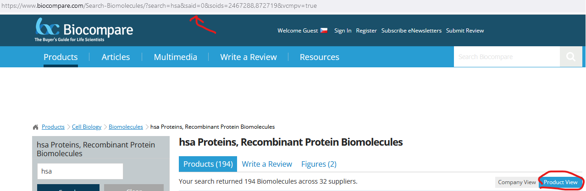
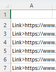

# AHKBiocompareScraper
Extracts data from tables within Biocompare product listings

### Uses
- Autohotkey v2
- Excel (might work with LibreOffice, haven't tested yet) 

Mistakes made when writing this script (I wasn't considering publishing it online, when I wrote it):
1) The output .txt file is not in any standardized format. I'm using the included websearch.xlsm file to sort it into into excel tables. If I'll have the time, I'll rewrite it to output something like JSON.
2) More mistakes were definitely made.

## How to use
1) You need to have Autohotkey instaled
2) Start the script linkScrapper.ahk
3) Copy (ctrl+c) the link of your search on biocompare website into clipboard (you should use product view, as that doesn't colapse the product listings, but the script will inform you of that)

4) F2 loads the link into the script
5) F1 starts the script
6) Once it is finished, you will get a message and the you will find your results in a linkscrapperOutput.txt, more results can be appended to the file if you wish
7) Copy the results into excel in cell A2 and start the "testsplit" macro.

8) The macro "hyperadd" can be used to convert selected range into clickable hyperlinks.
